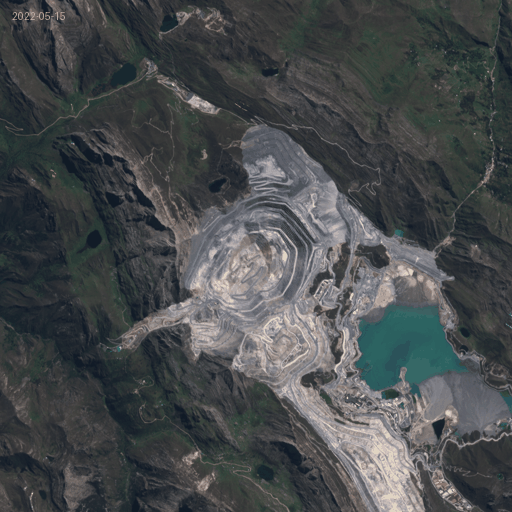
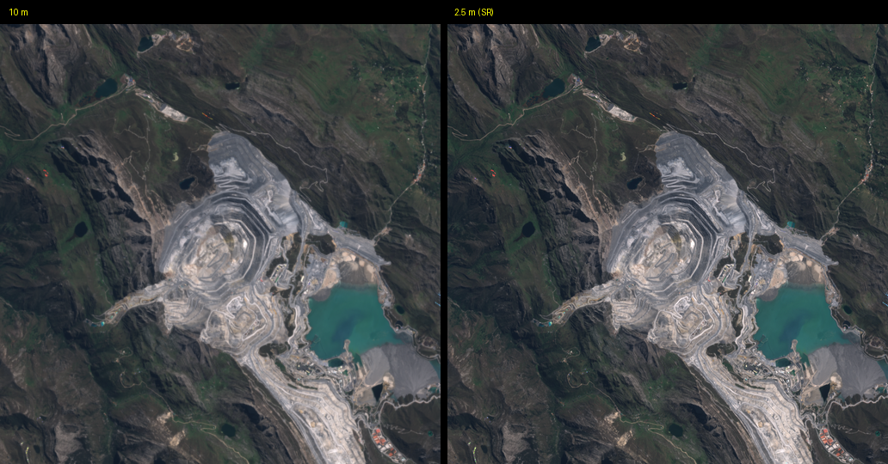
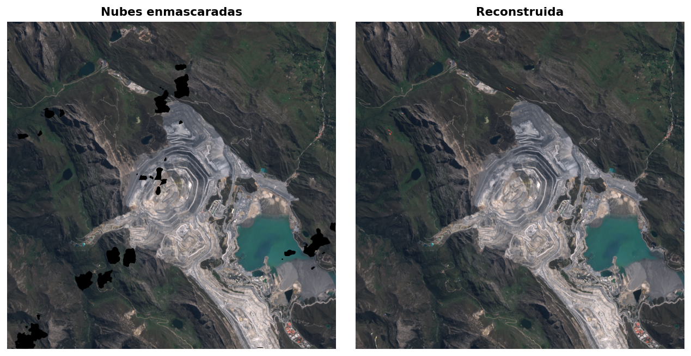

# satcube

<p align="center">
  
</p>

<p align="center">
    <em>De imágenes Sentinel-2 dispersas a cubos limpios, alineados y super-resueltos</em> 🛰️
</p>

<p align="center">
<a href='https://pypi.python.org/pypi/satcube'>
    
</a>
<a href="https://opensource.org/licenses/MIT" target="_blank">
    
</a>
<a href="https://github.com/psf/black" target="_blank">
    
</a>
</p>

---

**GitHub**: [https://github.com/andesdatacube/satcube](https://github.com/andesdatacube/satcube) 🌐

**PyPI**: [https://pypi.org/project/satcube/](https://pypi.org/project/satcube/) 🛠️

---

## Overview 📊

**satcube** convierte una serie de imágenes Sentinel-2 dispersas, tapadas por nubes y desalineadas en un **cubo mensual limpio, continuo y super-resuelto a 2.5 m**, con una API encadenable. Por dentro usa cubexpress para el acceso, CloudSEN12 para nubes, satalign para el co-registro y SEN2SR para la super-resolución.

<p align="center">
  
</p>

## Key features ✨
- **Acceso inteligente**: descubre y descarga S2 filtrando por nubes antes de bajar. 🛰️
- **Co-registro sub-píxel**: alinea toda la serie a la escena más limpia. 📐
- **Enmascarado de nubes**: máscara píxel a píxel con deep learning (CloudSEN12). ☁️
- **Reconstrucción temporal**: gap-filling, composites mensuales, despike e interpolación. 🧩
- **Super-resolución 4×**: de 10 m a 2.5 m con SEN2SR. 🔍
- **Un solo comando**: todo el pipeline con `process_all`. 🚀

## Installation ⚙️

```bash
pip install satcube
```

## Quickstart 🚀

Todo el pipeline en una llamada, de crudo a cubo super-resuelto:

```python
import ee
import satcube

ee.Authenticate()
ee.Initialize(project="ee-your-project")

meta = satcube.metadata(
    lon=-77.06165, lat=-9.53704,
    width=256, height=256,
    start="2018-01-01", end="2019-12-31",
    max_cloud=30,
).select_bands("B1", "B2", "B3", "B4", "B5", "B6", "B7", "B8", "B8A", "B9", "B10", "B11", "B12")

crudo = meta.download(output_dir="produccion/raw")

final = crudo.process_all(
    output_dir="produccion",
    min_clear_pct=70,
    max_remaining_gaps=1.0,
    device="cuda",          # usa "cpu" si no tienes GPU
    sr_variant="SEN2SRLite",
)
print(f"{len(final)} composites mensuales super-resueltos a 2.5 m")
```

<p align="center">
  
</p>

## Paso a paso 🛠️

Si prefieres controlar cada etapa (y entender qué hace cada una):

```python
# 1. Metadata + descarga
meta  = satcube.metadata(lon=-77.06165, lat=-9.53704, width=1024, height=1024,
                         start="2022-05-01", end="2022-09-01", max_cloud=30)
meta  = meta.select_bands("B1","B2","B3","B4","B5","B6","B7","B8","B8A","B9","B10","B11","B12")
cubo  = meta.download(output_dir="raw")

# 2. Co-registro sub-pixel
alineado = cubo.align(output_dir="aligned")

# 3. Enmascarado de nubes y filtro de calidad
masked = alineado.cloud_masking(output_dir="masked", device="cuda", save_mask=True)
limpio = masked[masked["clear_pct"] >= 70]

# 4. Gap-filling + filtro de huecos
relleno    = limpio.gapfill(output_dir="gapfilled")
relleno_ok = relleno[relleno["remaining_gaps_pct"] <= 1.0]

# 5. Composites mensuales + afinamiento
mensual   = relleno_ok.composite(output_dir="monthly", agg_method="median")
interp    = mensual.interpolate(output_dir="interp", despike_threshold=0.15)
suavizado = interp.smooth(output_dir="smooth", smooth_w=7, smooth_p=2)

# 6. Super-resolucion 10 m -> 2.5 m
sr = suavizado.superresolve(output_dir="sr", variant="SEN2SRLite", device="cuda")
```

<p align="center">
  
</p>

## Polígonos 🗺️

Para un distrito o cuenca en vez de un parche cuadrado:

```python
meta = satcube.metadata_polygon(geojson, start="2022-01-01", end="2023-01-01", max_cloud=30)
```

Acepta shapely, WKT o GeoJSON.

## Documentación 📚

Guías completas en la [documentación](https://andesdatacube.github.io/satcube/): instalación, quickstart y una explicación de cada etapa del pipeline.